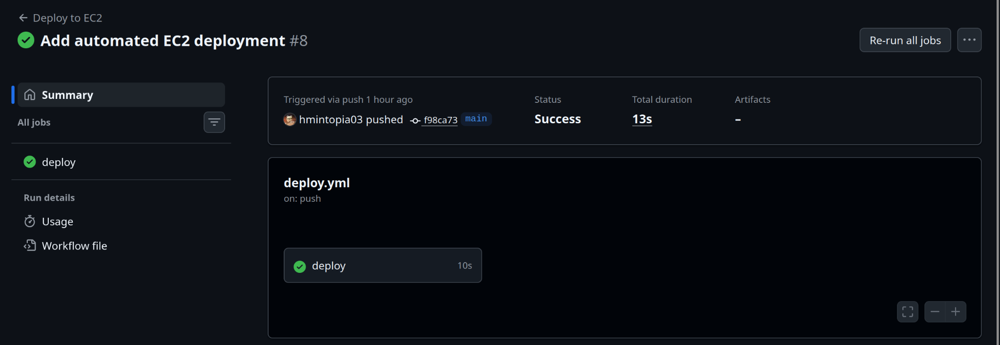
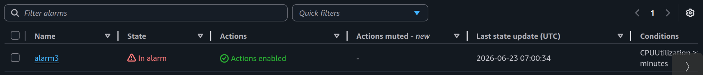

# Hello AWS

A cloud deployment project demonstrating how to deploy a containerized FastAPI application on AWS using Terraform, Docker, Amazon RDS, Amazon S3, GitHub Actions, and CloudWatch.

The project provisions infrastructure with Terraform, deploys application containers on EC2, stores application data in Amazon RDS, uploads files to Amazon S3 using IAM Roles, and automatically deploys updates through GitHub Actions.

The goal of the project is to gain hands-on experience with cloud infrastructure, infrastructure as code, CI/CD, monitoring, and AWS service integration.

## Architecture
```
Internet
  ↓
Nginx (EC2)
  ↓
FastAPI (Docker)
  ↙      ↘
RDS      S3

FastAPI
  ↓
IAM Role
  ↓
Amazon S3

GitHub Actions
  ↓
SSH Deploy
  ↓
EC2
```
Terraform provisions:
- EC2
- Elastic IP
- Security Group
- IAM Role
- RDS PostgreSQL
- S3 Bucket

## S3 Upload Demo


## CI/CD

The application is automatically deployed to EC2 through GitHub Actions whenever changes are pushed to the `main` branch.



## Features

* FastAPI REST API
* Amazon RDS PostgreSQL integration
* Amazon S3 file upload API
* Nginx reverse proxy
* Docker Compose deployment
* Infrastructure as Code with Terraform
* Elastic IP for stable public access
* IAM Role based AWS authentication
* Automated deployment with GitHub Actions

## Tech Stack

### Backend

* FastAPI
* Python 3.13

### Database

* Amazon RDS PostgreSQL 16

### Cloud Infrastructure

* AWS EC2
* Amazon RDS
* Amazon S3
* IAM
* Elastic IP
* Security Groups

### DevOps

* Docker
* Docker Compose
* Terraform
* GitHub Actions
* Nginx

## Local Development

```bash
docker compose up --build
```

Application:

```text
http://localhost:8000
```

## Infrastructure Provisioning

```bash
cd terraform-ec2

terraform init
terraform plan
terraform apply
```

Terraform provisions:

* EC2 Instance
* Security Group
* Elastic IP
* IAM Role and Instance Profile
* Amazon RDS PostgreSQL
* Amazon S3 Bucket

## CI/CD Pipeline

Every push to the `main` branch automatically:

1. Connects to EC2 via SSH
2. Pulls the latest source code
3. Rebuilds Docker images
4. Restarts application containers


## Monitoring and Incident Response

The application infrastructure is monitored using Amazon CloudWatch and Amazon SNS.

### CloudWatch Alarm

A CPU utilization alarm is configured for the EC2 instance:

* Metric: CPUUtilization
* Threshold: 80%
* Evaluation Period: 2 minutes
* Notification: Amazon SNS Email

### Incident Simulation

A production-like incident was intentionally created by stopping the FastAPI container behind Nginx.

Investigation process:

1. Application became unavailable and returned 502 Bad Gateway
2. CloudWatch alarm entered the ALARM state
3. Amazon SNS delivered an email notification
4. Docker containers were inspected using docker ps and docker logs
5. The failed FastAPI container was identified as the root cause
6. The container was restarted and service availability was restored
7. CloudWatch alarm returned to the OK state



## S3 File Upload

Upload a file:

```bash
curl -F "file=@README.md" http://<server-ip>/upload
```

Example response:

```json
{
  "bucket": "hello-aws-hmintopia03-uploads",
  "key": "uploads/example-file.txt"
}
```

Files are uploaded using EC2 IAM Role credentials.

No AWS access keys are stored in the application.

## Custom Domain

The application is accessible through a custom domain:

https://hyemincho.dev

DNS records are managed through Porkbun and point to the EC2 Elastic IP address.

HTTPS is enabled using Let's Encrypt SSL certificates.

## Monitoring

The infrastructure is monitored using Amazon CloudWatch and Amazon SNS.

### CloudWatch Alarm

A CPU utilization alarm is configured for the EC2 instance.

* Metric: CPUUtilization
* Threshold: 80%
* Evaluation Period: 2 minutes
* Notification: Amazon SNS Email

### Alarm Validation

The monitoring setup was validated using a real load test.

1. CPU load was generated on the EC2 instance using `yes > /dev/null`
2. CloudWatch detected the CPU spike
3. Alarm state changed from `OK` to `ALARM`
4. SNS notification was triggered
5. Alarm returned from `ALARM` to `OK` after load removal


## Incident Lab

Real troubleshooting notes and incident investigations are documented under:

```text
incident-lab/
```

Example:

```text
incident-lab/01-nginx-502.md
```

This incident documents a production outage caused by an Nginx reverse proxy configuration issue and the debugging process used to identify and resolve the problem.

## Lessons Learned

* Infrastructure resources can become difficult to manage without Infrastructure as Code.
* IAM Roles provide a safer authentication mechanism than storing AWS access keys inside applications.
* Monitoring systems should be validated with real workload generation rather than configuration alone.
* CloudWatch alarms can accidentally target obsolete EC2 instances after infrastructure changes.
* Docker container state and application source code can diverge during deployment and troubleshooting.
* GitHub Actions simplifies deployments but deployment logs remain critical for debugging failures.

```
```
